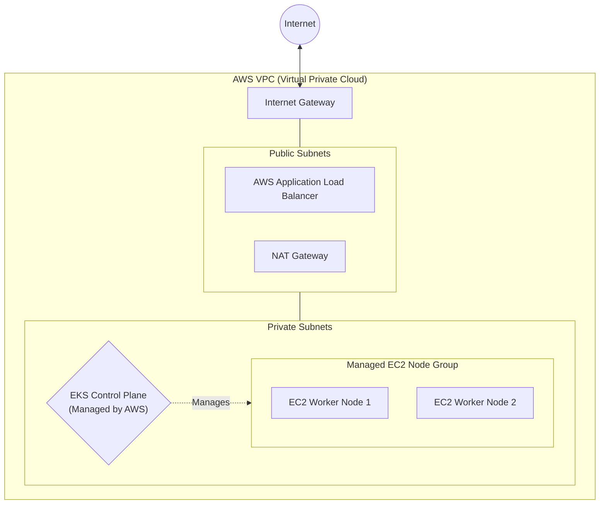

# AWS Cloud Infrastructure Concepts

## 1. VPC (Virtual Private Cloud) & Subnets
* **What it is:** A VPC is your own logically isolated section of the AWS Cloud. Subnets are chunks of IP addresses within that VPC. Public subnets have a route to the internet; Private subnets do not.
* **Where it is used:** For security, our EKS Cluster's worker nodes (EC2 instances) will live in Private subnets so they cannot be accessed directly from the internet. Only the Application Load Balancer (ALB) lives in the Public subnet.

## 2. Amazon EKS (Elastic Kubernetes Service)
* **What it is:** A managed service where AWS runs the Kubernetes **Control Plane** (the brain of the cluster, including the API server and etcd database) for you. 
* **Where it is used:** It offloads the hardest part of managing Kubernetes. Instead of you having to manage the "Control Plane Nodes" (formerly known as master nodes) for high-availability and state backups, AWS handles all of that seamlessly. You are only responsible for managing the "Worker Nodes" and your applications.

## 3. EC2 Node Groups
* **What it is:** The actual physical (virtual) worker machines that run your Pods. A "Managed Node Group" means AWS handles the provisioning and lifecycle of these EC2 instances.
* **Where it is used:** The Cluster Autoscaler will monitor our cluster. If we try to schedule 100 Pods and run out of room, the Autoscaler tells the Node Group to automatically boot up more EC2 instances.

## 4. IAM Roles & IRSA (IAM Roles for Service Accounts)
* **What it is:** IAM Roles dictate what AWS resources can talk to each other. IRSA is a specific security feature that allows you to assign an AWS IAM role to a specific Kubernetes Pod, rather than giving permissions to the entire EC2 instance.
* **Where it is used:** If our K8s microservice needs to read from an S3 bucket or manage an ALB, we use IRSA to give *only* that specific Pod permission to do so.

## 5. AWS Network Topology

This diagram shows the physical/logical network boundaries in AWS. Notice how worker nodes are strictly kept in Private Subnets for security.

