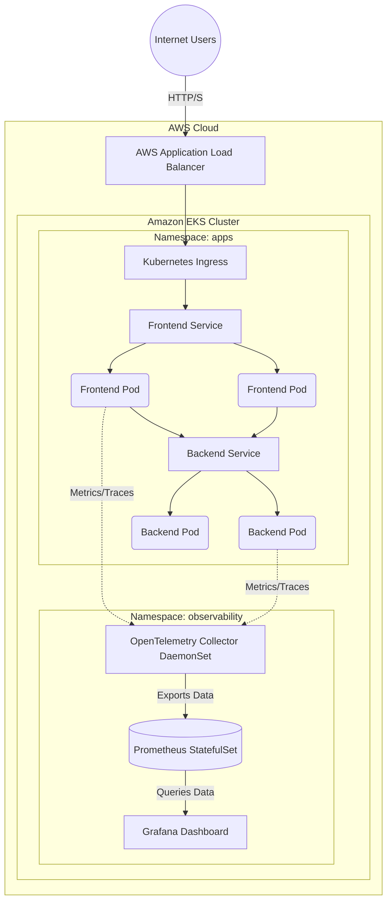

# Target AWS EKS & Observability Architecture

This diagram illustrates the flow of internet traffic to our microservices, and how telemetry data is scraped from those services into our observability platform.

