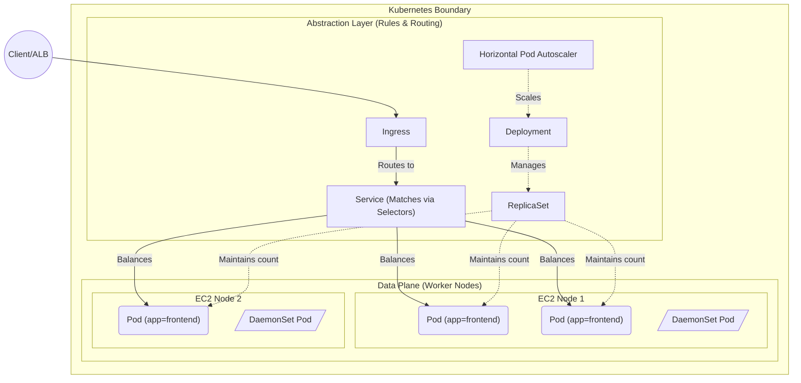

# Kubernetes Core Concepts

## 1. Pods
* **What it is:** The smallest deployable computing unit in Kubernetes. It encapsulates one or more containers (like Docker containers), storage resources, and a unique network IP.
* **Where it is used:** You never deploy a "container" directly to K8s; you deploy a Pod. In our project, our Flask/Node microservices will each run inside their own Pods.

## 2. Deployments & ReplicaSets
* **What is a ReplicaSet:** A core object that ensures a specified number of identical Pod replicas are running at all times. If a node crashes and a Pod dies, the ReplicaSet immediately brings up a new Pod to maintain the desired count.
* **Where ReplicaSets are used:** You rarely create ReplicaSets directly. They are the background engine used to guarantee high availability for our microservice Pods.
* **What is a Deployment:** A higher-level controller that manages ReplicaSets. It provides declarative updates for Pods—meaning it handles safely rolling out a new version of your container image (a rolling update) without downtime.
* **Where Deployments are used:** We use Deployments as the primary way to define and launch our Frontend and Backend microservices. The Deployment will automatically spin up the underlying ReplicaSet for us.

## 3. Services
* **What it is:** Pods are ephemeral-they die and get new IPs constantly. A Service provides a single, static IP address and DNS name to access a group of Pods. It acts as an internal load balancer. In short, it is a stable network abstraction over group of Pods that do the same job. It acts as a router. 
* **Where it is used:** So our Frontend can talk to our Backend without worrying about which specific Backend Pods are currently alive.

## 4. Ingress
* **What it is:** An API object that provides routing rules for external HTTP/HTTPS traffic to reach services inside the cluster. It separates the *rules* (the Ingress Resource) from the *router* (the Ingress Controller, e.g., the AWS Load Balancer Controller or Nginx). While similar to an API Gateway in routing capabilities, it generally lacks advanced management features like billing or complex authentication unless paired with specific controllers or service meshes.
* **Where it is used:** We use an Ingress to tie our internal K8s Services to AWS. When we deploy our Ingress YAML, the AWS Load Balancer Controller reads it and automatically provisions a physical AWS Application Load Balancer (ALB) to route public internet traffic to our Frontend Service.

## 5. Horizontal Pod Autoscaler (HPA)
* **What it is:** A controller that dynamically increases or decreases the number of Pods in a Deployment based on observed metrics (like average CPU utilization).
* **Where it is used:** To handle traffic spikes. During our load test, when CPU hits 50%, HPA will tell the Deployment to spin up more microservice Pods.

## 6. DaemonSets
* **What it is:** Ensures that exactly *one* copy of a specific Pod runs on *every single physical Node* in the cluster.
* **Where it is used:** Critical for observability. We use DaemonSets to run the **OpenTelemetry Collector** on every EC2 instance so we can capture metrics/logs from the underlying machine and all apps running on it.

## 7. Labels and Selectors
* **What it is:** The primary mechanism Kubernetes uses to group objects together. Labels are key/value tags attached to objects (like Pods). Selectors are queries used by Services and Deployments to find those tagged objects.
* **Where it is used:** This is how a Service knows *which* Pods it is abstracting over. If a Backend Service has a selector of `app: backend`, it will automatically route traffic to any Pod in the cluster that has the tag `app: backend`, instantly discovering new Pods as they spin up.

## 8. The Control Plane vs. Data Plane
* **What it is:** Kubernetes architecture is strictly divided into two halves:
    * **The Control Plane (The Brain):** Manages the cluster. It includes the API server (how you talk to K8s), `etcd` (the database storing cluster state), and the Scheduler (decides where Pods should go).
    * **The Data Plane / Worker Nodes (The Muscle):** The actual virtual/physical machines (EC2 instances) where your microservices (Pods) run.
* **Why it is needed:** Separation of concerns and high availability. If a Worker Node running your app crashes under heavy load, it won't crash the management layer. The Control Plane survives, detects the crash, and reschedules the orphaned Pods onto a healthy Worker Node.
* **Where it is used (EKS Example):** In Amazon EKS, AWS completely hides and manages the Control Plane for you. You never see the API server or `etcd` nodes. You only pay for and manage the Data Plane (your managed EC2 worker nodes).
* **Real-World Analogy:** Think of a restaurant. The Control Plane is the Manager/Host who takes reservations, assigns tables, and monitors staff, but never actually cooks. The Data Plane is the Kitchen Staff who executes the actual work (runs your containers).

## 9. Capacity Planning & Multi-Dimensional Scaling

Kubernetes scaling happens on two distinct axes: scaling the application (Pods) and scaling the infrastructure (Nodes).

### A. Capacity Planning (Requests & Limits)
Before autoscaling can function, the cluster must understand the resource footprint of your application. This is defined in the Pod YAML:
* **Requests (The Guarantee):** The minimum CPU/Memory required for the Pod to run. The Scheduler uses this to determine if a Node has enough free space to host the Pod. If no space exists, the Pod remains `Pending`.
* **Limits (The Ceiling):** The maximum CPU/Memory the Pod is permitted to consume. Exceeding memory limits results in an immediate **OOMKilled** (Out Of Memory) pod termination. Exceeding CPU results in throttling.

### B. Workload Scaling (Application Level)
* **Horizontal Pod Autoscaler (HPA):** Scales *out*. It watches metrics (like CPU crossing 60%) and adds more identical Pod replicas to the Deployment to distribute the load.
* **Vertical Pod Autoscaler (VPA):** Scales *up*. It increases the CPU/Memory limits of existing Pods rather than adding new ones. (Rarely used concurrently with HPA on the same metric).
* **KEDA (Kubernetes Event-driven Autoscaling):** An advanced controller that allows HPA to scale based on external events (e.g., the depth of a Kafka topic or AWS SQS queue) rather than just raw CPU usage.

### C. Infrastructure Scaling (Node Level)
When the HPA demands new Pods but all underlying EC2 nodes are full, those Pods enter a `Pending` state.
* **Cluster Autoscaler (CA):** Watches the K8s scheduler. The instant it spots a `Pending` Pod due to insufficient capacity, it commands AWS to boot up a new EC2 instance and join it to the cluster.
* **Karpenter:** A modern, highly-performant alternative to CA built by AWS. It bypasses rigid Auto Scaling Groups and provisions the exact right size/type of EC2 instance "just-in-time" based on the specific scheduling constraints of the `Pending` pods.

***The Complete Flow:***
Traffic spikes -> CPU spikes -> HPA creates new Pods -> Pods go `Pending` -> CA/Karpenter provisions new EC2 Node -> Pods are scheduled -> System stabilizes.

## 10. Kubernetes Concept Topology

This diagram strictly visualizes how the internal K8s objects map to each other, highlighting the separation between the Control Plane (the controllers) and the Data Plane (the physical execution).

