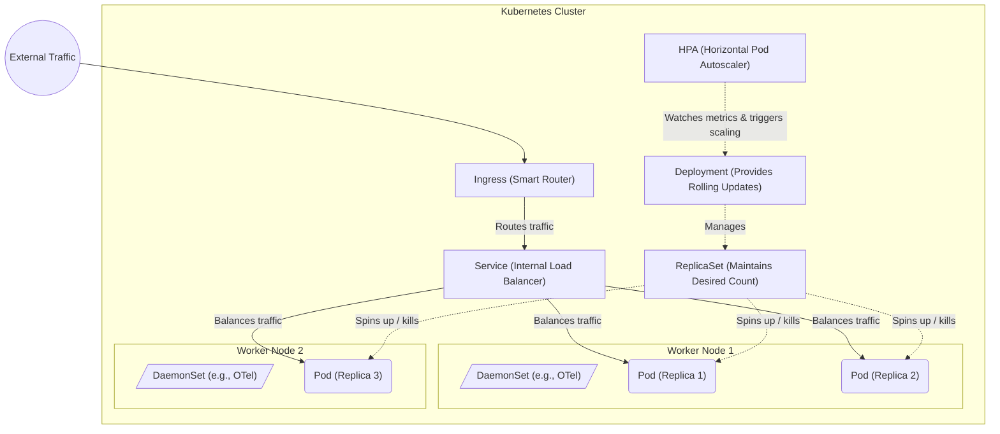

# Kubernetes Core Concepts

## 1. Pods
* **What it is:** The smallest deployable computing unit in Kubernetes. It encapsulates one or more containers (like Docker containers), storage resources, and a unique network IP.
* **Where it is used:** You never deploy a "container" directly to K8s; you deploy a Pod. In our project, our Flask/Node microservices will each run inside their own Pods.

## 2. Deployments & ReplicaSets
* **What is a ReplicaSet:** A core object that ensures a specified number of identical Pod replicas are running at all times. If a node crashes and a Pod dies, the ReplicaSet immediately brings up a new Pod to maintain the desired count.
* **Where ReplicaSets are used:** You rarely create ReplicaSets directly. They are the background engine used to guarantee high availability for our microservice Pods.
* **What is a Deployment:** A higher-level controller that manages ReplicaSets. It provides declarative updates for Pods—meaning it handles safely rolling out a new version of your container image (a rolling update) without downtime.
* **Where Deployments are used:** We use Deployments as the primary way to define and launch our Frontend and Backend microservices. The Deployment will automatically spin up the underlying ReplicaSet for us.

## 3. Services
* **What it is:** Pods are ephemeral-they die and get new IPs constantly. A Service provides a single, static IP address and DNS name to access a group of Pods. It acts as an internal load balancer. In short, it is a stable network abstraction over group of Pods that do the same job. It acts as a router. 
* **Where it is used:** So our Frontend can talk to our Backend without worrying about which specific Backend Pods are currently alive.

## 4. Ingress
* **What it is:** An API object that provides routing rules for external HTTP/HTTPS traffic to reach services inside the cluster. It separates the *rules* (the Ingress Resource) from the *router* (the Ingress Controller, e.g., the AWS Load Balancer Controller or Nginx). While similar to an API Gateway in routing capabilities, it generally lacks advanced management features like billing or complex authentication unless paired with specific controllers or service meshes.
* **Where it is used:** We use an Ingress to tie our internal K8s Services to AWS. When we deploy our Ingress YAML, the AWS Load Balancer Controller reads it and automatically provisions a physical AWS Application Load Balancer (ALB) to route public internet traffic to our Frontend Service.

## 5. Horizontal Pod Autoscaler (HPA)
* **What it is:** A controller that dynamically increases or decreases the number of Pods in a Deployment based on observed metrics (like average CPU utilization).
* **Where it is used:** To handle traffic spikes. During our load test, when CPU hits 50%, HPA will tell the Deployment to spin up more microservice Pods.

## 6. DaemonSets
* **What it is:** Ensures that exactly *one* copy of a specific Pod runs on *every single physical Node* in the cluster.
* **Where it is used:** Critical for observability. We use DaemonSets to run the **OpenTelemetry Collector** on every EC2 instance so we can capture metrics/logs from the underlying machine and all apps running on it.

## 7. Labels and Selectors
* **What it is:** The primary mechanism Kubernetes uses to group objects together. Labels are key/value tags attached to objects (like Pods). Selectors are queries used by Services and Deployments to find those tagged objects.
* **Where it is used:** This is how a Service knows *which* Pods it is abstracting over. If a Backend Service has a selector of `app: backend`, it will automatically route traffic to any Pod in the cluster that has the tag `app: backend`, instantly discovering new Pods as they spin up.
* 
## 8. Concept Interaction Diagram

This diagram shows how these K8s components link together: how traffic flows in via Ingress, and how Deployments/HPA manage the underlying Pods.

