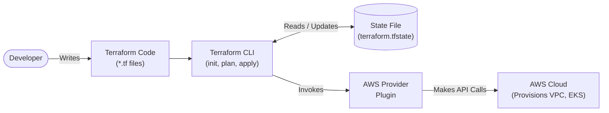

# Terraform Infrastructure-as-Code Concepts

## 1. Providers
* **What it is:** Plugins that Terraform uses to translate its code into API calls for a specific platform (AWS, Azure, Kubernetes, etc.).
* **Where it is used:** We use the `aws` provider to build the VPC and EKS cluster, the `kubernetes` provider to configure the cluster, and the `helm` provider to install our observability stack natively via Terraform.

## 2. State (.tfstate)
* **What it is:** A JSON file where Terraform maps real-world cloud resources to your configuration files. 
* **Where it is used:** This is how Terraform keeps track of what it has already built. It’s what allows running `terraform destroy` to accurately clean up every single resource it created without leaving orphaned infrastructure behind.

## 3. Modules
* **What it is:** Self-contained packages of Terraform configurations that bundle multiple resources together. 
* **Where it is used:** Instead of writing thousands of lines of code to build a secure VPC and an EKS cluster from scratch, we use the official AWS `vpc` and `eks` community modules to build proven, production-grade infrastructure with just a few lines of code.

## 4. Resources vs. Data Sources
* **What it is:** A `resource` tells Terraform to *create* something new. A `data` source tells Terraform to *fetch information* about something that already exists.
* **Where it is used:** We use resources to create our Node Groups, but we might use a data source to fetch the latest Amazon Linux AMI ID to use for those nodes.

## 5. Anatomy of our `main.tf` Code

To understand how the actual code works, here is a breakdown of the specific blocks we used to build our EKS cluster:

### A. The `data` Block
```hcl
data "aws_availability_zones" "available" {}
```
* **What it does:** This is a read-only query. We are asking AWS, "Give me a list of all the Availability Zones in this region that are currently awake and healthy." We use the result of this query to intelligently place our subnets later, without having to hardcode `us-west-2a`, `us-west-2b`, etc.

### B. The `vpc` Module
```hcl
module "vpc" {
  source  = "terraform-aws-modules/vpc/aws"
  # ... lines omitted for brevity
}
```
* **What it does:** Instead of writing raw `resource "aws_vpc"` and `resource "aws_subnet"` commands (which would take hundreds of lines to configure routing tables correctly), we are pulling a pre-built community module from the Terraform Registry. We just pass it our desired IP range (`10.0.0.0/16`) and it does all the math to carve out public and private subnets.

### C. The `eks` Module
```hcl
module "eks" {
  source  = "terraform-aws-modules/eks/aws"
  # ... lines omitted for brevity
  vpc_id                   = module.vpc.vpc_id
  subnet_ids               = module.vpc.private_subnets
}
```
* **What it does:** This pulls the official AWS EKS module to build the cluster. 
* **Crucial Concept (Interpolation):** Notice how we didn't hardcode a VPC ID. We wrote `module.vpc.vpc_id`. This is exactly how Terraform builds its dependency graph! Terraform reads this and says: *"Ah, the EKS module needs the Output ID of the VPC module. Therefore, I must fully build the VPC **before** I start building EKS."* 


## 6. Terraform Execution Flow

This diagram illustrates how Terraform takes your declarative code, compares it against the locally saved state, and uses the Provider to make API calls to AWS.



