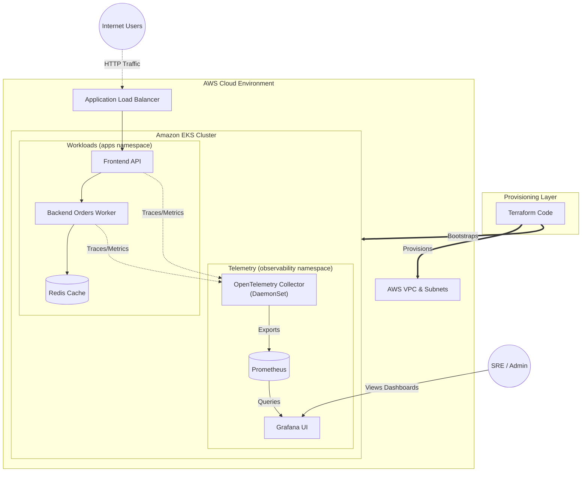

# Full Stack Architecture
This diagram illustrates the complete, end-to-end architecture of the platform. It maps the provisioning layer (Terraform), the physical cloud layer (AWS), the container orchestration layer (Kubernetes), and the observability pipeline (OpenTelemetry/Grafana).

